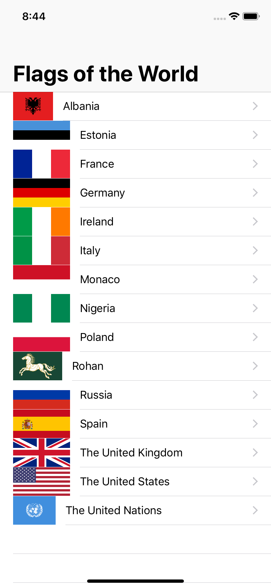
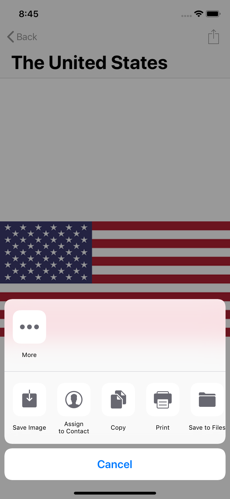

# Day 23: Milestone for Projects 1-3


_Follow along at https://www.hackingwithswift.com/100/23_.


## 📒 Field Notes

This day resolves around recapping the content covered while going through Projects 1-3 in _[Hacking with Swift](https://www.hackingwithswift.com/read)_. I won't try to rehash what I wrote up already, but a few additional key points are worth mentioning:

- When we instantiate a view controller in code, and the view controller is based on what we've set up in our storyboard, we need to communicate this to iOS by using the `storyboard.instantiateViewController` method:

```swift
if let vc = storyboard?.instantiateViewController(withIdentifier: "Detail") as? DetailViewController {

}
```

- `UIActivityViewController` can do a lot. And so, not surprisingly, some of its capabilities overlap with permissions. For example, if we want our app to be able to save an image to the photo library, we need to configure the target's `info.plist` file it to ask for the `Privacy - Photo Library Additions Usage Description` permission.

- Each `UIView` element has a `layer` property, which is [an instance of the `CALayer` class](https://developer.apple.com/documentation/uikit/uiview/1622436-layer). While UIView elements also have their own higher-level styling properties, this can unlock access to styling at a lower-level for things related to `CoreAnimation` such as gradients and particle effects.


## 🥅 Challenge

A good way to end a recap is to extend on things. Day 23 ends with a challenge project:

> Create an app that lists various world flags in a table view. When one of them is tapped, slide in a detail view controller that contains an image view, showing the same flag full size. On the detail view controller, add an action button that lets the user share the flag picture and country name using UIActivityViewController.

Feel free to peruse the finished project [here]. In the meantime... a few screenshots:



- One thing I couldn't figure was how to ensure each image in the table view was the same size just by using the default cell. The flag of Albania asset is actually rather large, but for some reason its being resized to a smaller version. Perhaps I need to experiment more with the image scaling settings &mdash; or use a custom cell class for more fine-grained control.




## 🔗 Related Links

[Ray Wenderlich: CALayer Tutorial for iOS](https://www.raywenderlich.com/402-calayer-tutorial-for-ios-getting-started)
