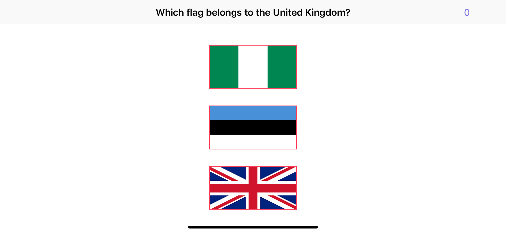

# Day 30: Project 6, Part One

_Follow along at https://www.hackingwithswift.com/100/30_.

## 📒 Field Notes

This day covers the first part of `Project 6: Auto Layout` in _[Hacking with Swift](https://www.hackingwithswift.com/read/6)_.

I have a [separate repository](https://github.com/CypherPoet/book--hacking-with-swift) where I've been creating projects alongside the material in the book. And you can find Project 6 [here](https://github.com/CypherPoet/book--hacking-with-swift/tree/master/06-auto-layout). However, I also copied it over to this day's folder so I can extend from where I left off.

With that in mind, Day 30 focuses on several specific topics:

- Advanced Auto Layout
- Auto Layout in code: addConstraints() with Visual Format Language

### Advanced Auto Layout

Using Auto Layout to get our vertical stack of flags viewable &mdash; all at once &mdash; in landscape mode comes with some nuance.

Initially setting the "Bottom Space to Safe Area" constraint on the bottom flag (I tend to think of this process as "pinning") gives it a fixed, _constant_ amount of spacing with a `Relation` of `Equal`. This leads to Auto Layout stretching or squeezing content in order to meet those demands &mdash; and in this case, the flags get squeezed to 0 in landscape mode (because the constant value is greater than the height of the entire screen!).

And there's a lesson in that: Auto Layout constraints can be used for flexibility &mdash; but they can also be used for precision and concreteness. We want the flexibility.

By changing the `Relation` from `Equal` to `Greater Than or Equal`, and the `Constant` to `20`, we unlock just that. Alas, it's still not perfect &mdash; Auto Layout still squashes _one_ flag in the middle &mdash; But Auto Layout has options now. And we only need a few more tweaks on top:

- Set each flag to be of `Equal Heights` with respect to its adjacent flag. Now an odd flag won't be resized.
- Add the `Aspect Ratio` constraint to each flag, internally, so that width will be resized in accordance with any changes to height.

Presto 💥

### Auto Layout in code: addConstraints() with Visual Format Language

