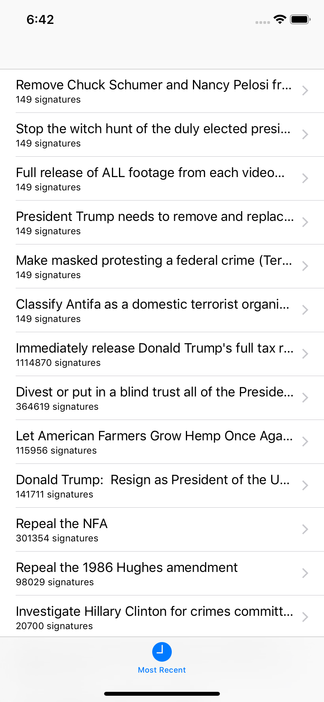

# Day 33: _Project 7: Whitehouse Petitions_, Part One

_Follow along at https://www.hackingwithswift.com/100/33_.

## 📒 Field Notes

This day covers the first part of `Project 7: Whitehouse Petitions` in _[Hacking with Swift](https://www.hackingwithswift.com/read/7)_.

You can find the entire project I made to follow along in this folder, but Day 33, in particular, focuses on several specific topics:

- Creating the basic UI: `UITabBarController`
- Parsing JSON using the `Codable` protocol

### Creating the basic UI: `UITabBarController`

While it's a subclass of `UIViewController`, `UITabBarController` is meant to [manage an array of view controllers](https://developer.apple.com/documentation/uikit/uitabbarcontroller) that users can choose between by selecting them from a set of bottom bar buttons. Our project doesn't address it in this day, but I'm very interested in the best practices for managing the said list of view controllers &mdash; and integrating that pattern within the app's overarching navigation patterns.

In due time, though. In the _mean_ time, we can use it to set the stage for our app's two views: a "most recent" petitions list and a "popular" petitions list. Apple offers a pre-defined set of icons for each `UITabBarItem` that just so happen to suit these purposes.

And I find it interesting that we would need to go out of our way to use our own icons. On one hand, it can seem pretentious, but on the other hand, I completely respect this. Consistent navigation patterns are a cornerstone of good UX, and `UITabBarItem`s for the `UITabBarController` are a cornerstone of said navigation. If there's not a good reason to use a custom icon here, system defaults FTW 💪.

### Parsing JSON using the `Codable` protocol

Being a relatively recent addition to Swift, `Codeable` (introduced in Swift 4.0) couldn't have come sooner. Being able to use a built-in, first-party, standardized protocol for encoding (serializing) and decoding (deserializing) JSON into and from Swift structs/classes is tremendously useful. I can see myself saying "use `Codable` for all the things" now 😛.

## 🛠 Project Progress

## 🔗 Additional/Related Links

- [Swift by Sundell Basics: Codable](https://www.swiftbysundell.com/basics/codable)
- [Apple docs on UITabBarController](https://developer.apple.com/documentation/uikit/uitabbarcontroller)
