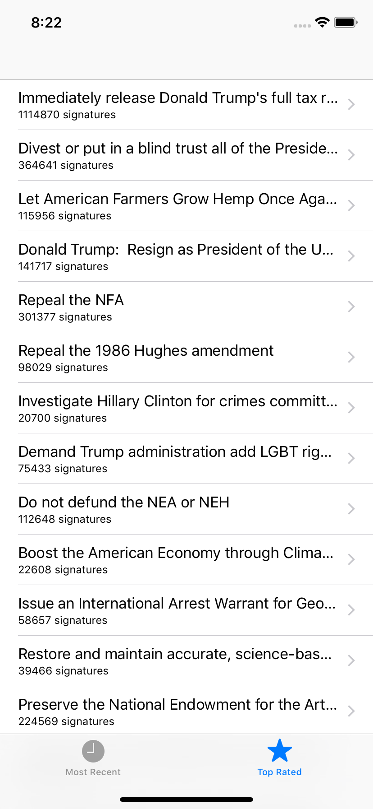

# Day 34: _Project 7: Whitehouse Petitions_, Part Two

_Follow along at https://www.hackingwithswift.com/100/34_.


## 📒 Field Notes

This day covers the second part of `Project 7: Whitehouse Petitions` in _[Hacking with Swift](https://www.hackingwithswift.com/read/7)_.

You can find the entire project I made to follow along in the folder of Day 33, but Day 34, in particular, focuses on several specific topics:

- Rendering a petition: `loadHTMLString`
- Finishing touches: `didFinishLaunchingWithOptions`


### Rendering a petition: `loadHTMLString`

During our initial introduction to `WKWebView`, I was wondering whether or not there were still any compelling use cases for it now that `SFSafariViewController` has been introduced. `WKWebView.loadHTMLString` might be one example.

If we have some kind of dynamic HTML string that we want to use for rendering, this method can give us a style of creating our own views that `SFSafariViewController` doesn't offer. Our current app is a bit of a toy example &mdash; I'd probably create a custom, native UI and feed our petition data to its various elements &mdash; but it serves as a solid proof of concept. I can imagine a scenario where an API _only_ returns HTML. And in that case, we could feed it straight in to `loadHTMLString` (perhaps after also checking for malicious script injections 👮‍).


### Finishing touches: `didFinishLaunchingWithOptions`

One of the first hooks generated in a project's `AppDelegate.swift` file, `application(_:didFinishLaunchingWithOptions:)` is where we can perform set-up operations for our app when we know that it's _just_ about to start running.

And that's the perfect place for configuring our `UITabBarController`, wiring up the two child view controllers we need it to manage.

```swift
if let tabBarController = window?.rootViewController as? UITabBarController {
    let storyboard = UIStoryboard(name: "Main", bundle: nil)
    let navController = storyboard.instantiateViewController(withIdentifier: "Petitions Nav Controller")

    navController.tabBarItem = UITabBarItem(tabBarSystemItem: .topRated, tag: 1)
    tabBarController.viewControllers?.append(navController)
}
```

In some cases, a storyboard might do, but on the scale of storyboard to code, the fact that our tab bar's two view stacks are pretty much identical pushes tips things towards the latter ⚖️.

#### Configuring the API URL

Our two view controllers do have on _minor_ difference: their API URLs. One way to handle this is to have the view controller check its position within the tab par and infer which URL it should use:

```swift
if navigationController?.tabBarItem.tag == 0 {
    apiURLString = "https://api.whitehouse.gov/v1/petitions.json?limit=100"
} else {
    apiURLString = "https://api.whitehouse.gov/v1/petitions.json?signatureCountFloor=10000&limit=100"
}
```

I prefer a more top-down approach, though. Rather than making the petitions view controller aware of our tab-bar designs, we can store our API urls in an `enum`, and then have our code in `application(_:didFinishLaunchingWithOptions:)` decide which controllers get to use which URLs. Iterating on the earlier `didFinishLaunchingWithOptions` example, I came up with this:

```swift
if let tabBarController = window?.rootViewController as? UITabBarController {
    let storyboard = UIStoryboard(name: "Main", bundle: nil)
    let navController = storyboard.instantiateViewController(withIdentifier: StoryboardId.petitionsNavController)
    let petitionsViewController = navController.children.first as? PetitionsListViewController

    petitionsViewController?.apiURLString = PetitionsAPI.popularPetitions
    navController.tabBarItem = UITabBarItem(tabBarSystemItem: .topRated, tag: 1)
    tabBarController.viewControllers?.append(navController)
}
```

(Only one modification is used here, because I _did_ leave the `PetitionsAPI.popularPetitions` as the default for the `PetitionsListViewController`).


## 🛠 Project Progress




## 🔗 Additional/Related Links

- [UINavigationController And UITabBarController Programmatically (Swift 4)](https://medium.com/@ITZDERR/uinavigationcontroller-and-uitabbarcontroller-programmatically-swift-3-d85a885a5fd0)
