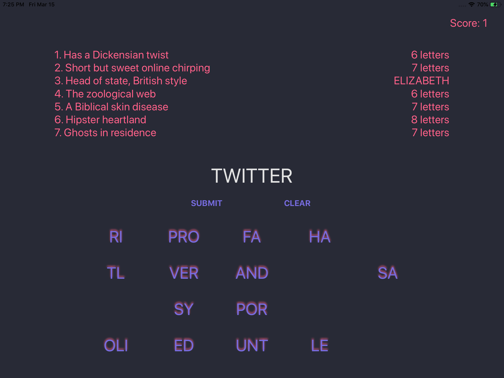

# Day 38: _Project 8: 7 Swifty Words_, Part Three

_Follow along at https://www.hackingwithswift.com/100/38_.

## 📒 Field Notes

This day covers the third and final part of `Project 8: 7 Swifty Words` in _[Hacking with Swift](https://www.hackingwithswift.com/read/8)_.

I have a [separate repository](https://github.com/CypherPoet/book--hacking-with-swift) where I've been creating projects alongside the material in the book. And you can find Project 8 [here](https://github.com/CypherPoet/book--hacking-with-swift/tree/master/08-seven-swifty-words/Seven%20Swifty%20Words). However, I also copied it over to Day 36's folder so I could extend from where I left off.

With that in mind, Day 38 focuses on focuses extending the project according a set of challenges.

## 🥅 Challenges

### Challenge 1

> Use the techniques you learned in project 2 to draw a thin gray line around the buttons view, to make it stand out from the rest of the UI.

- 🔗 [Commit](https://github.com/CypherPoet/100-days-of-swift/commit/2897464a1744a1e5979d1b510ac07594d6aa8430)

### Challenge 2

> If the user enters an incorrect guess, show an alert telling them they are wrong.

- 🔗 [Already Covered 🙂](https://github.com/CypherPoet/100-days-of-swift/blob/2897464a1744a1e5979d1b510ac07594d6aa8430/day-036/project/Seven%20Swifty%20Words/Source/Controllers/Home/HomeViewController.swift#L323)

### Challenge 3

> Try making the game also deduct points if the player makes an incorrect guess. Think about how you can move to the next level – we can’t use a simple division remainder on the player’s score any more, because they might have lost some points.

- 🔗 [Commit](https://github.com/CypherPoet/100-days-of-swift/commit/fd76cb6af46e9c82c00ef47f934dbffcc8228a59)

## 📸 Screens

  

