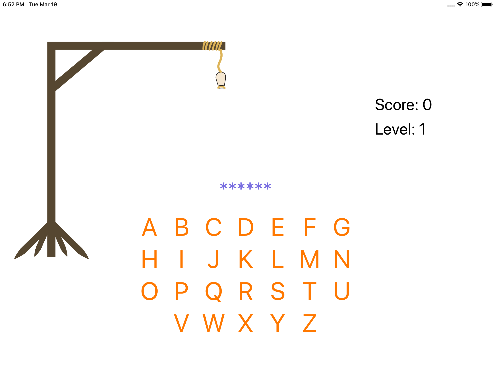
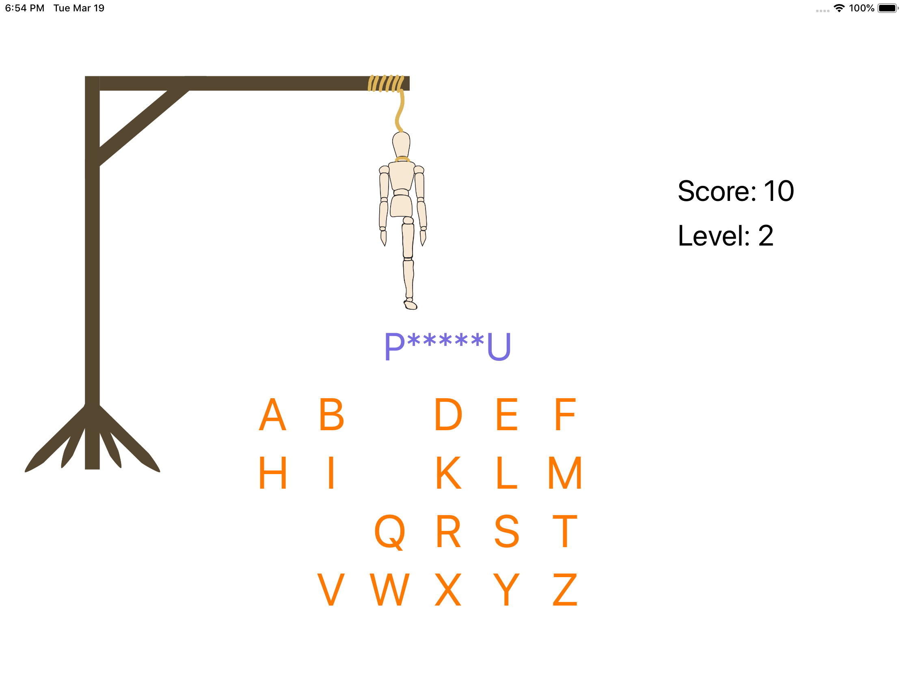
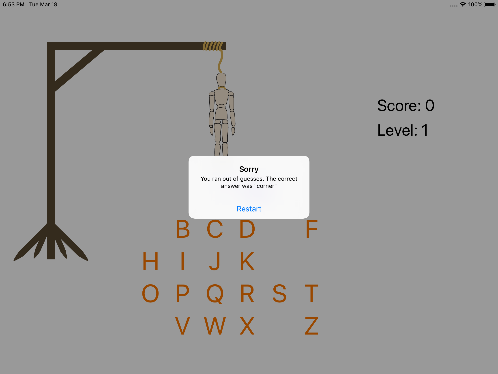

# Day 41: Milestone for Projects 7-9

_Follow along at https://www.hackingwithswift.com/100/41_.

## 📒 Field Notes

This day resolves around recapping the content covered while going through Projects 7-9 in _[Hacking with Swift](https://www.hackingwithswift.com/read)_, and then implementing a challenge project. Regarding the recap, I won't try to rehash what I wrote up already &mdash; but there is one thing that bears repeating: Always update the UI on the main thread 🙂.

## 🥅 Challenge Project

From https://www.hackingwithswift.com/guide/4/3/challenge:

> Make a hangman game using UIKit.

Hanging people seems a bit barbaric, so instead, I came up with _Hangmannequin_. Feel free to peruse the finished project [here](./project). In the meantime... a few screenshots:

  

  

  

