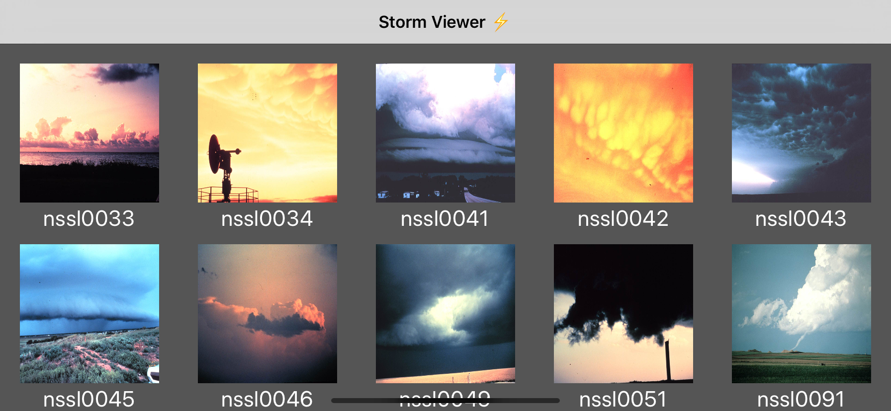
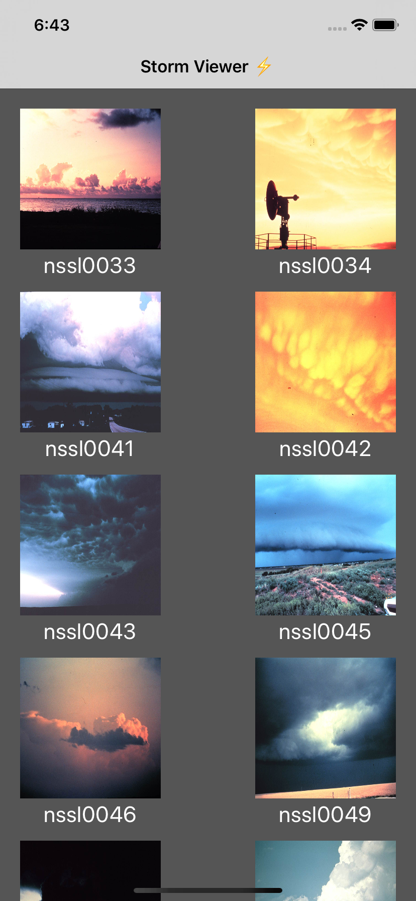

# Day 44: _Project 10: Names and Faces_, Part Three

_Follow along at https://www.hackingwithswift.com/100/44_.

## 📒 Field Notes

This day covers the third and final part of `Project 10: Names and Faces` in _[Hacking with Swift](https://www.hackingwithswift.com/read/10)_.

I have a [separate repository](https://github.com/CypherPoet/book--hacking-with-swift) where I've been creating projects alongside the material in the book. And you can find Project 10 [here](https://github.com/CypherPoet/book--hacking-with-swift/tree/master/10-names-and-faces/Names%20And%20Faces). However, I also copied it over to Day 42's folder so I could extend from where I left off.

With that in mind, Day 44 focuses on focuses extending the project according a set of challenges.

## 🥅 Challenges

### Challenge 1

> Add a second `UIAlertController` that gets shown when the user taps a picture, asking them whether they want to rename the person or delete them.

- 🔗 [Commit](https://github.com/CypherPoet/100-days-of-swift/commit/4f8341af3e47b09af59b14635db4bf6bd13bf9be)

### Challenge 2

> Try using `picker.sourceType = .camera` when creating your image picker, which will tell it to create a new image by taking a photo. This is only available on devices (not on the simulator) so you might want to check the return value of `UIImagePickerController.isSourceTypeAvailable()` before trying to use it!

- 🔗 [Already Covered 🙂](https://github.com/CypherPoet/100-days-of-swift/blob/4f8341af3e47b09af59b14635db4bf6bd13bf9be/day-042/project/Names%20And%20Faces/Source/Scenes/Home/HomeViewController.swift#L136)

### Challenge 3

> Modify `Project 1` so that it uses a collection view controller rather than a table view controller.

- 🔗 [Commit](https://github.com/CypherPoet/100-days-of-swift/commit/d144dcc2f0b18b3cd98d9bbc57324ad9eb2423da)

## 📸 Screens

  

 
 

  

