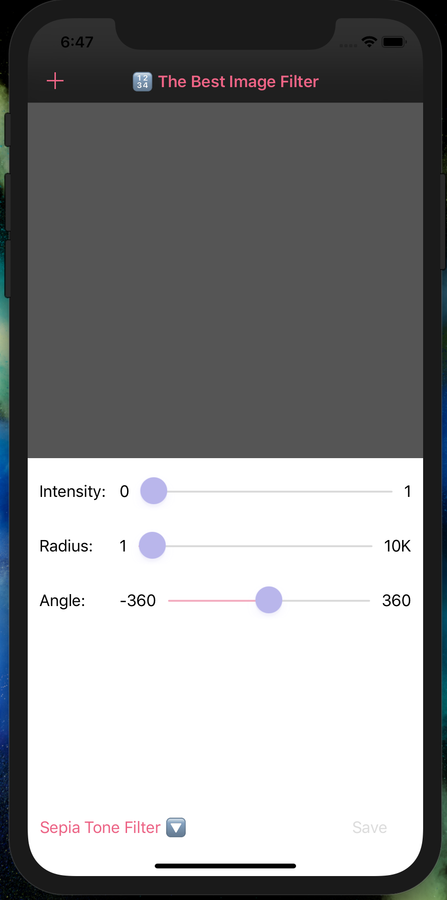
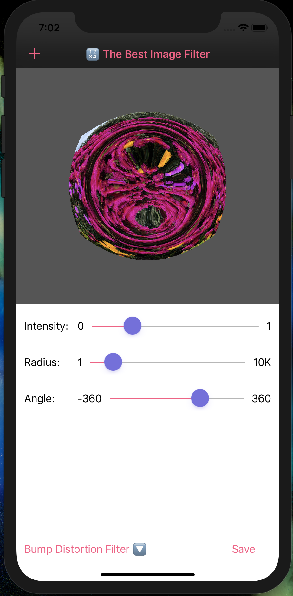

# Day 54: _Project 13: Instafilter_, Part Three

_Follow along at https://www.hackingwithswift.com/100/54_.

## 📒 Field Notes

> This day covers the third and final part of `Project 13: Instafilter` in _[Hacking with Swift](https://www.hackingwithswift.com/read/13)_.
>
> I previously created projects alongside the material in the book in a [separate repository](https://github.com/CypherPoet/book--hacking-with-swift). And you can find Project 13 [here](https://github.com/CypherPoet/book--hacking-with-swift/tree/master/13-instafilter). Even better, though, I copied it over to Day 52's folder so I could extend it from where I left off.
>
> With that in mind, Day 54 focuses on extending the project according to a set of challenges.

## 🥅 Challenges

### Challenge 1

> Try making the Save button show an error if there was no image in the image view.

- 🔗 [Commit](https://github.com/CypherPoet/100-days-of-swift/commit/1401ce7f4fd4ad9e1b7b9ea5048a338bc8a257c0)
    + I took a slightly different approach and made the save button disabled until an image was present 🙂.

### Challenge 2

> Make the Change Filter button change its title to show the name of the currently selected filter.

- 🔗 [Commit](https://github.com/CypherPoet/100-days-of-swift/commit/a09740718e36956152e294684951d949c018afaa)

### Challenge 3

> Experiment with having more than one slider, to control each of the input keys you care about. For example, you might have one for radius and one for intensity.

- 🔗 [Commit](https://github.com/CypherPoet/100-days-of-swift/commit/b2776a106969756efec0ab4289d6104dae994121)

## 📸 Screens

  
  

## 🔗 Additional/Related Links

- [Apple's Core Image Filter Reference](https://developer.apple.com/library/archive/documentation/GraphicsImaging/Reference/CoreImageFilterReference/index.html)
- [Core Image Filter Reference](https://cifilter.io/)
