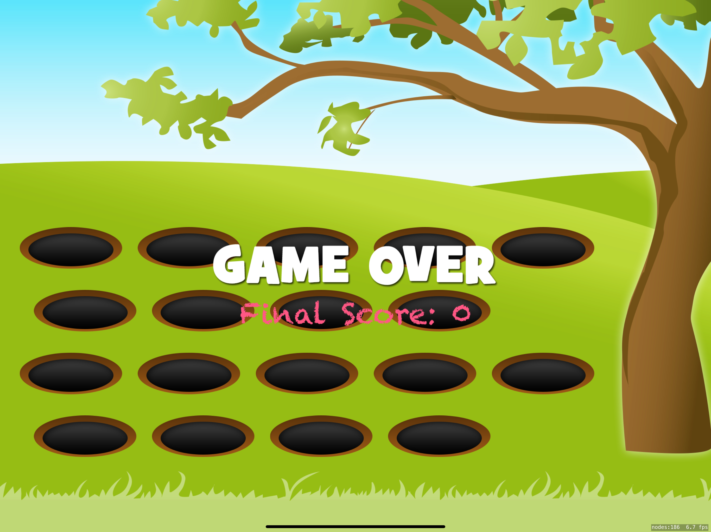
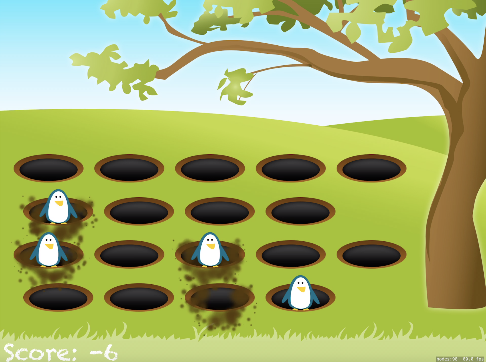
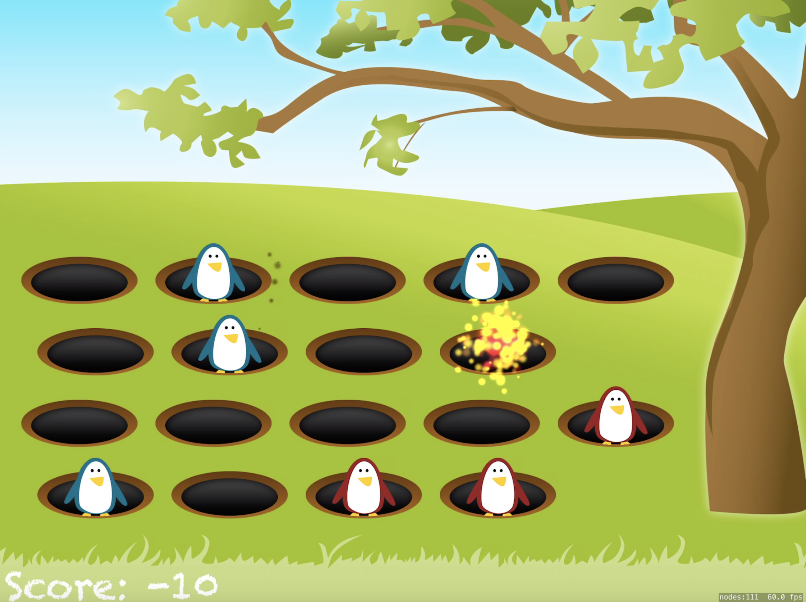
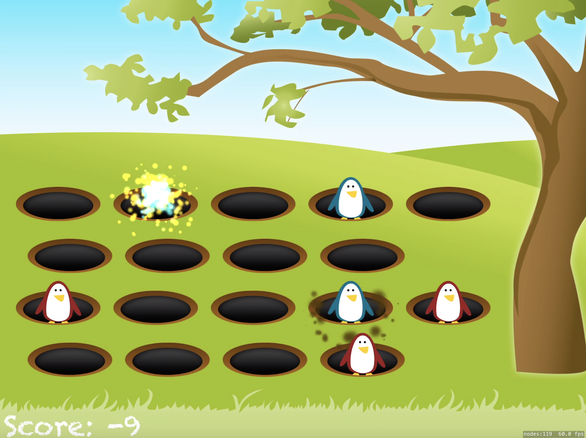

# Day 56: _Project 14: Whack-a-Penguin_, Part Two

_Follow along at https://www.hackingwithswift.com/100/56_.


## 📒 Field Notes

> This day covers the second and final part of `Project 14: Whack-a-Penguin` in _[Hacking with Swift](https://www.hackingwithswift.com/read/14)_.
>
> I previously created projects alongside _Hacking with Swift_ in a [separate repository](https://github.com/CypherPoet/book--hacking-with-swift), and you can find Project 14 [here](https://github.com/CypherPoet/book--hacking-with-swift/tree/master/14-whack-a-penguin/Whack%20a%20Penguin). Even better, though, I copied it over to Day 55's folder so I could extend it for _100 Days of Swift_.
>
> With that in mind, Day 56 focuses on several specific topics:
>
> - SKAction sequences
> - Wrapping up and extending the project with a set of challenges


### SKAction Sequences

I alluded to it in [Day 55] when I was highlighting the way I created an `SKAction` _group_ for hiding a penguin in a slot...


```swift
extension WhackSlot {

    var showAction: SKAction {
        return SKAction.moveBy(x: 0, y: 80, duration: 0.05)
    }

    var hideActions: SKAction {
        return SKAction.group([
            SKAction.moveBy(x: 0, y: -80, duration: 0.05),
            SKAction.scale(to: 0.08, duration: 0.025),
            SKAction.run { [weak self] in
                self?.isShowingPenguin = false
            },
        ])
    }
}
```

... but `SKAction` _sequences_ allow us to take that composability even further. With `SKAction.sequence`, we can declare SKActions to be run **one after another**, and since an `SKAction.group` is, itself, an `SKAction`, we can run sequences with groups without skipping a beat:

```swift
func whack() {
    guard isShowingPenguin && !isWhacked else { return }

    isWhacked = true

    let delay = SKAction.wait(forDuration: 0.25)

    penguinNode.run(SKAction.sequence([delay, hideActions]))
}
```


## 🥅 Challenges


### Challenge 1

> Record your own voice saying "Game over!" and have it play when the game ends.

- 🔗 [Commit](https://github.com/CypherPoet/100-days-of-swift/commit/69b6338a9403475f1e149c018c4ff309cb3736e9)


### Challenge 2

> When showing “Game Over” add an SKLabelNode showing the user's final score.

- 🔗 [Commit](https://github.com/CypherPoet/100-days-of-swift/commit/1aaf99543ae43583ed7fe77bbed884cefee0b721)


### Challenge 3

> Use SKEmitterNode to create a smoke-like effect when penguins are hit, and a separate mud-like effect when they go into or come out of a hole.

- 🔗 [Commit](https://github.com/CypherPoet/100-days-of-swift/commit/7f112b367b6e95e8ba795f1fbc710a2354a6ccfa)


## 📸 Screenshots

<div style="text-align: center;">
  
  
  
  
</div>


## 🔗 Additional/Related Links

- [Apple Docs: SKEmitterNode](https://developer.apple.com/documentation/spritekit/skemitternode)
- [Apple Docs: Optimizing Emitter Node Performance](https://developer.apple.com/documentation/spritekit/skemitternode/optimizing_emitter_node_performance)
