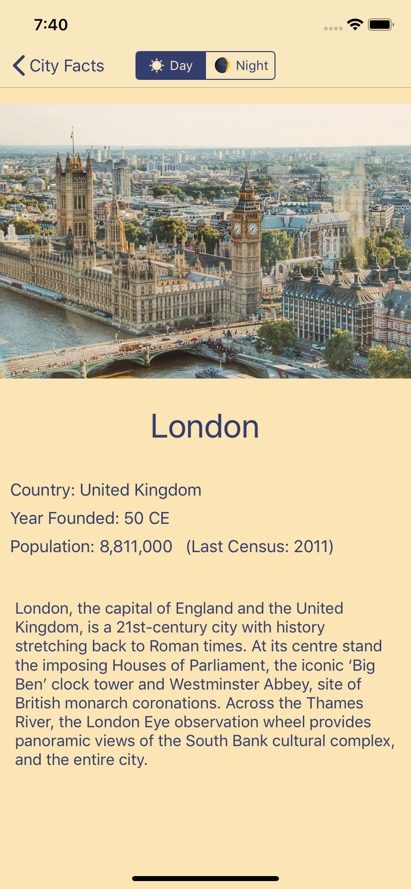
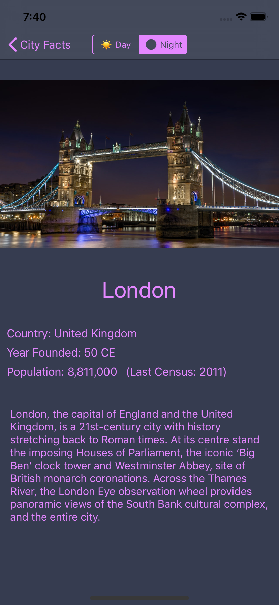
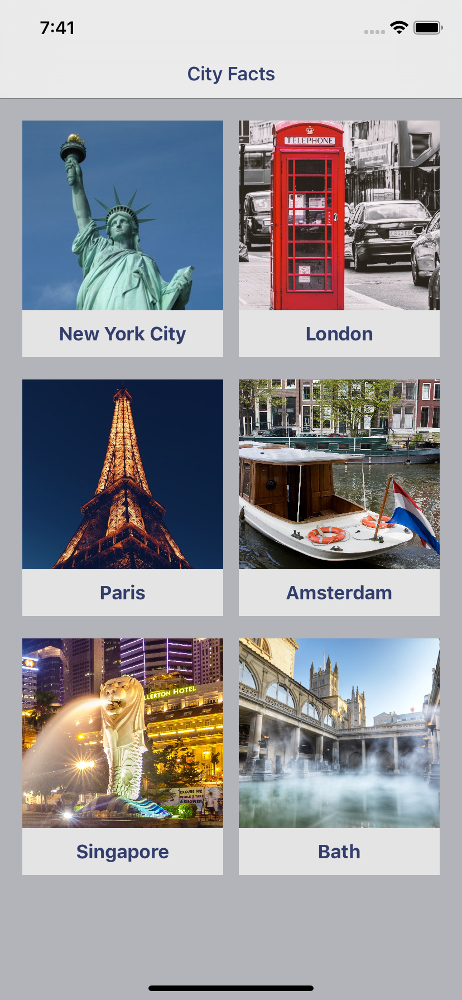

# Day 59: Milestone for Projects 13-15

_Follow along at https://www.hackingwithswift.com/100/59_.

## 📒 Field Notes

> This day resolves around recapping the content covered while going through Projects 13-15 in _[Hacking with Swift](https://www.hackingwithswift.com/read)_, and then implementing a challenge project.

Regarding the recap, I won't try to rehash what I wrote up already &mdash; but a few extra things are worth noting.

### Closure Capturing and Animations

Unlike, say, the completion handler of a `UIAlertController`, we don't need to worry about capturing `self` within the `animations` or `onComplete` closures of `UIView.animate`. I didn't realize this at first &mdash; and, indeed, there's no _harm_ in using `[weak self]` too liberally &mdash; but it's nice to have more clarity.

If I'm reasoning about it correctly, this is because (again, unlike the completion handler of a `UIAlertController`) our current context (`self`) doesn't _own_ `UIView.animate` &mdash; and so even if the closure captures it strongly, it's a one-way ownership that won't lead to reference cycles.

## 🥅 Challenge Project

From https://www.hackingwithswift.com/guide/6/3/challenge:

> Your challenge is to make an app that contains facts about countries: show a list of country names in a table view, then when one is tapped bring in a new screen that contains its capital city, size, population, currency, and any other facts that interest you

Feel free to peruse the finished project [here](./project) ✌️.

 
 

  
  
  

