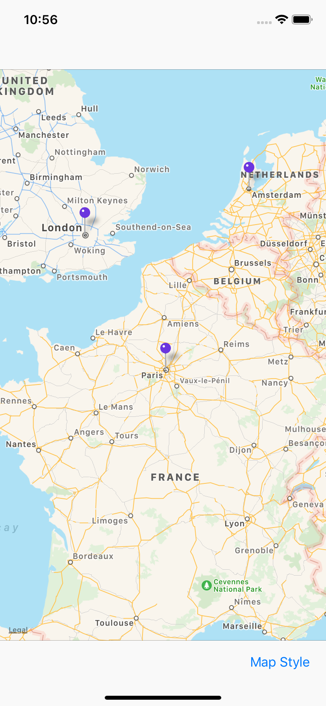
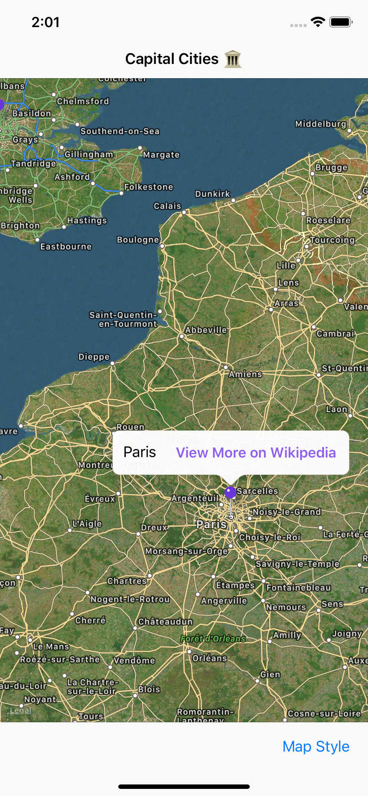
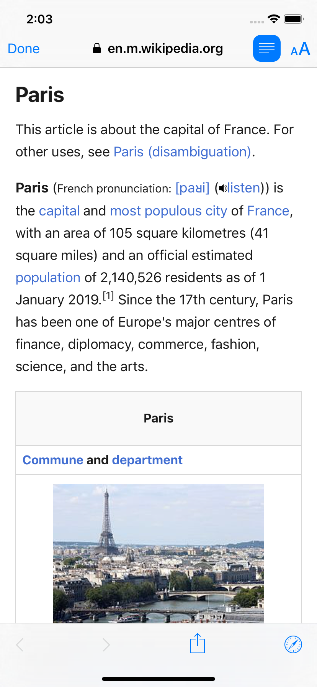

# Day 61: _Project 16: Capital Cities_, Part Two

_Follow along at https://www.hackingwithswift.com/100/61_.

## 📒 Field Notes

> This day covers the second and final part of `Project 16: Capital Cities` in _[Hacking with Swift](https://www.hackingwithswift.com/read/16)_.
>
> I previously created projects alongside _Hacking with Swift_ in a [separate repository](https://github.com/CypherPoet/book--hacking-with-swift), and you can find Project 16 [here](https://github.com/CypherPoet/book--hacking-with-swift/tree/master/19-capital-cities/Capital%20Cities). Even better, though, I copied it over to Day 60's folder so I could extend it for _100 Days of Swift_.
>
> With that in mind, Day 61 focuses on extending the project with a set of challenges.

## 🥅 Challenges

### Challenge 1

> Try typecasting the return value from `dequeueReusableAnnotationView()` so that it's an `MKPinAnnotationView`. Once that’s done, change the `pinTintColor` property to your favorite UIColor.

- 🔗 [Commit](https://github.com/CypherPoet/100-days-of-swift/commit/f61634431ce358065b23c7bf53966d9b2e29acd9)

### Challenge 2

> Add a `UIAlertController` that lets users specify how they want to view the map. There's a `mapType` property that draws the maps in different ways. For example, `.satellite` gives a satellite view of the terrain.

- 🔗 [Already Covered 🙂](https://github.com/CypherPoet/100-days-of-swift/blob/f61634431ce358065b23c7bf53966d9b2e29acd9/day-060/project/Capital%20Cities/Capital%20Cities/Scenes/MainViewController.swift#L42)

### Challenge 3

> Modify the callout button so that pressing it shows a new view controller with a web view, taking users to the Wikipedia entry for that city.

- 🔗 [Commit](https://github.com/CypherPoet/100-days-of-swift/commit/26e63a9d6eec505eaef4cf203226e4b779146474)

## 📸 Screenshots

  
  
  

