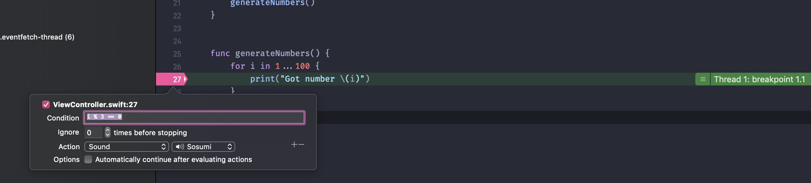

# Day 64: _Project 18: Debugging_, Part One


_Follow along at https://www.hackingwithswift.com/100/64_.


## 📒 Field Notes

> This day covers the first part of `Project 18: Debugging` in _[Hacking with Swift](https://www.hackingwithswift.com/read/18)_.
>
> I previously created projects alongside _Hacking with Swift_ in a [separate repository](https://github.com/CypherPoet/book--hacking-with-swift), and you can find Project 18 [here](https://github.com/CypherPoet/book--hacking-with-swift/tree/master/18-debugging/Debugging). Even better, though, I copied it over to Day 64's folder so I could extend it for _100 Days of Swift_.
>
> With that in mind, Day 64 focuses on several specific topics:
>
> - Basic Swift debugging using print()
> - Debugging with assert()
> - Debugging with breakpoints
> - View debugging


### Basic Swift Debugging using print()

In most cases, `print` statements should be temporary statements that are cleaned up before we're ready to ship our app (or even commit to `master` 🙂). But `print` has some interesting nuances:

- It's actually a variadic function:
  ```swift
  print("What", "do", "you", "know?")

  // >> What do you know?
  ```

- It can take a `separator` argument:
  ```swift
  print("What", "do", "you", "know?", separator: "👏")

  // >> What👏do👏you👏know?
  ```

- It can take a `terminator` argument:
  ```swift
  print("👏", terminator: "")
  print("What", "do", "you", "know?", separator: "👏", terminator: "")
  print("👏", terminator: "")

  // >> 👏What👏do👏you👏know?👏
  ```

### Debugging with assert()

In development, `assert` will crash our code if it evaluates to `false`, printing its corresponding error message:

```swift
assert(1 == 1, "Math is incorrect.")
assert(1 == 2, "Your math is incorrect.")
```

This is just scratching the surface of a pattern that's very much like `guard` &mdash; the difference being that the "false" scenario is conceptualized as an error, not just something we don't want to deal with.

Swift gives us `assert`, `assertionFailure`, `precondition`, `preconditionFailure`, and `fatalError` as methods to crash our code with more insight into what actually went wrong and where. [This article](https://blog.krzyzanowskim.com/2015/03/09/swift-asserts-the-missing-manual/) serves as a handy guide to how each function is treated by the compiler, and, thus, which environments suit each best.


### Debugging with Breakpoints

This is where Xcode gets to shine. By setting a breakpoint at a line, we can stop our code, and have the editor enter a "Debug" view precisely when it happens.

But that's not all.

Xcode breakpoints can, themselves, be augmented with conditions and actions to perform when hit:

<div style="text-align: center;">
  
</div>

Among many things, this reduces the amount of debugging logic we'd otherwise be placing in our code. Sometimes we want it in our code, sure &mdash; but when we don't, Xcode breakpoints can be a great help.


### View Debugging

Again, we're really just scratching the surface here, but it goes without saying that having a live, interactive, layered visual rendering of the app's current view is vital for debugging. And Xcode delivers with the nifty layout available in **Debug** > **View Debugging** > **Capture View Hierarchy**. Do you some good and get to know it! 🙂


## 🔗 Additional/Related Links

- [Swift asserts - the missing manual](https://blog.krzyzanowskim.com/2015/03/09/swift-asserts-the-missing-manual/)
