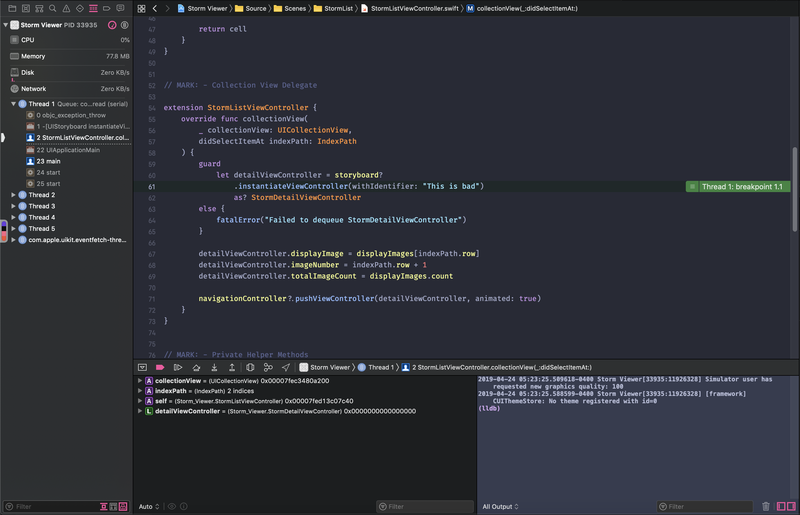
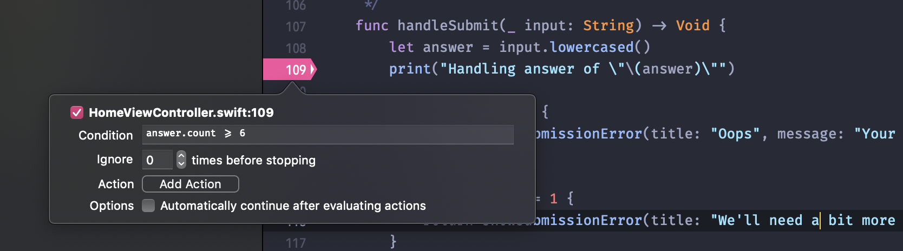

# Day 65: _Project 18: Debugging_, Part Two

_Follow along at https://www.hackingwithswift.com/100/65_.

## 📒 Field Notes

> This day covers the second and final part of `Project 18: Debugging` in _[Hacking with Swift](https://www.hackingwithswift.com/read/18)_.
>
> It focuses on extending our debugging exploration with a set of challenges.

## 🥅 Challenges

### Challenge 1

> Temporarily try adding an exception breakpoint to `project 1`, then changing the call to `instantiateViewController()` so that it uses the storyboard identifier “Bad” – this will fail, but your exception breakpoint should catch it.

- 🔗 [Commit](https://github.com/CypherPoet/100-days-of-swift/commit/03dac44cc64243405fb90673358fa516b10b1bae)
- 📸 

### Challenge 2

> In `project 1`, add a call to `assert()` in the `viewDidLoad()` method of `DetailViewController.swift`, checking that `selectedImage` always has a value.

- 🔗 [Commit](https://github.com/CypherPoet/100-days-of-swift/commit/b44b4d8696e9fdd96c18f413e2d4b411740a6570)

### Challenge 3

> Go back to `project 5`, and try adding a conditional breakpoint to the start of the `submit()` method that pauses only if the user submits a word with six or more letters.

- 📸 

