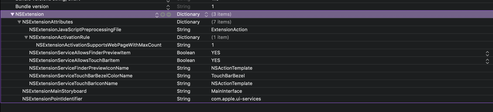

# Day 67: _Project 19: JavaScript Injection_, Part One

_Follow along at https://www.hackingwithswift.com/100/67_.


## 📒 Field Notes

> This day covers the first part of `Project 19: JavaScript Injection` in _[Hacking with Swift](https://www.hackingwithswift.com/read/19)_.
>
> I previously created projects alongside _Hacking with Swift_ in a [separate repository](https://github.com/CypherPoet/book--hacking-with-swift), and you can find Project 19 [here](https://github.com/CypherPoet/book--hacking-with-swift/tree/master/16-safari-extension). Even better, though, I copied it over to Day 67's folder so I could extend it for _100 Days of Swift_.
>
> With that in mind, Day 67 focuses on several specific topics:
>
> - Making a shell app
> - Adding an extension: NSExtensionItem
> - What do you want to get?


### Making a Shell App

Safari App Extensions have "App" in the name for a reason: Every extension ships alongside a full-fledged iOS or MacOS application that serves as a "shell".

This is important to keep in mind, because the shell has to exist even if the bulk of our code and functionality is going to be in the extension.


### Adding an Extension: `NSExtensionItem`

- When our extension item is created, we get access to an `extensionContext`, which lets us control how our extension interacts with its parent app.

- `extensionContext` has an `inputItems` array that the parent app might send it.

- `inputItems` contains a list of `NSExtensionItem`s &mdash; each of which has an optional `attachments` array that contains a list of "Item providers".

- Each item provider has a `loadItem` function, which takes a completion closure. It's _here_ that we can process a dictionary of data contained in the item, and use it to update data in the context of our extension.

Making this even more intricate is the fact that most of the aforementioned values are wrapped up in Objective-C, so some additional `guard`ing, casting, and long `NSDictionary` key name usage is in order:

```swift
func processItemProvider() {
    // `inputItems` should be an array of data that the parent app is sending to our extension to use
    guard let inputItem = extensionContext!.inputItems.first as? NSExtensionItem else { return }

    // Our input item contains an array of attachments, which are given to us wrapped up as an `NSItemProvider`
    guard let itemProvider = inputItem.attachments?.first else { return }

    let typeIdentifier = kUTTypePropertyList as String

    // After finding the provider, we need to ask it to actually provide us with its item
    itemProvider.loadItem(
        forTypeIdentifier: typeIdentifier,
        options: nil,
        completionHandler: { [weak self] (dict, error) in
            let itemDictionary = dict as! NSDictionary
            let javaScriptValues = itemDictionary[NSExtensionJavaScriptPreprocessingResultsKey] as! NSDictionary

            DispatchQueue.main.async {
                self?.pageURL = javaScriptValues["URL"] as! String
                self?.pageTitle = javaScriptValues["title"] as! String
            }
        }
    )
}
```


### What do you want to get?

Demanding a similar meticulousness as item-provider loading is the process of configuring the extension's `Info.plist` file so that its identity, capabilities, and access limits are known to Safari. Apple has more [thorough](https://developer.apple.com/documentation/safariservices/safari_app_extensions/safari_app_extension_info_property_list_keys) [documentation](https://developer.apple.com/documentation/safariservices/safari_app_extensions/safari_app_extension_info_property_list_keys/about_contextual_menu_and_toolbar_item_keys) on these options. For this project, we're mainly concerned about `NSExtensionActivationSupportsWebPageWithMaxCount`, as well as `NSExtensionJavaScriptPreprocessingFile`:

<div style="text-align: center;">
  
</div>


## 🔗 Additional/Related Links

- [Apple Docs: Safari App Extensions](https://developer.apple.com/documentation/safariservices/safari_app_extensions)
