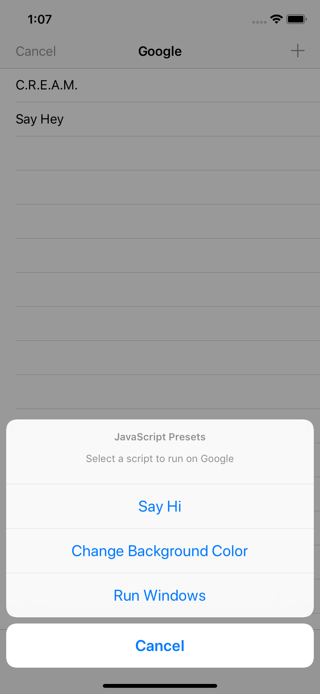

# Day 69: _Project 19: JavaScript Injection_, Part Three

This day covers the third and final part of `Project 19: JavaScript Injection` in _[Hacking with Swift](https://www.hackingwithswift.com/read/19)_. Follow along at https://www.hackingwithswift.com/100/69.

## 📒 Field Notes

> I previously created projects alongside _Hacking with Swift_ in a [separate repository](https://github.com/CypherPoet/book--hacking-with-swift), and you can find Project 19 [here](https://github.com/CypherPoet/book--hacking-with-swift/tree/master/23-space-race). Even better, though, I copied it over to Day 67's folder so I could extend it for _100 Days of Swift_.
>
> With that in mind, Day 69 focuses on extending the project with a set of challenges.

## 🥅 Challenges

### Challenge 1

> Add a bar button item that lets users select from a handful of pre-written example scripts, shown using a `UIAlertController` – at the very least your list should include the example we used in this project.

- 🔗 [Commit](https://github.com/CypherPoet/100-days-of-swift/commit/f3cb30e52a833b0f3ffedcf3f569e20987bcf09e)

### Challenges 2 and 3

> You're already receiving the URL of the site the user is on, so use `UserDefaults` to save the user's JavaScript for each site. You should convert the URL to a `URL` object in order to use its host property.

> For something bigger, let users name their scripts, then select one to load using a `UITableView`.

- 🔗 I knocked these out together over a [series of commits after Challenge 1](https://github.com/CypherPoet/100-days-of-swift/commit/5ad1b680cdceaec1d78c056e1eb9b10e07fb7dac).

## 📸 Screenshots

  
  

