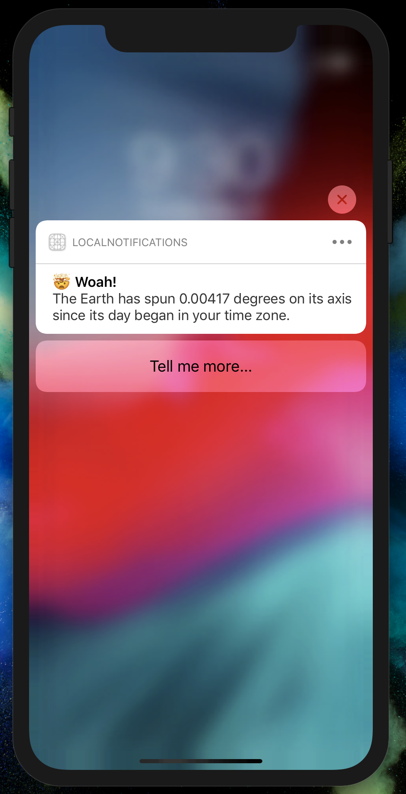

# Day 72: _Project 21: Local Notifications_, Part One

This day covers the first part of `Project 21: Local Notifications` in _[Hacking with Swift](https://www.hackingwithswift.com/read/21)_.
You can follow along directly [here](https://www.hackingwithswift.com/100/72).


## 📒 Field Notes

> I previously created projects alongside _Hacking with Swift_ in a [separate repository](https://github.com/CypherPoet/book--hacking-with-swift). For _100 Days of Swift_, however, I've been extending things further and adding my projects to this repo under each "Part One" folder.
>
> With that in mind, Day 72 focuses on several specific topics:
>
> - Scheduling Notifications: `UNUserNotificationCenter` and `UNNotificationRequest`
> - Acting on responses


### Scheduling Notifications: `UNUserNotificationCenter` and `UNNotificationRequest`

Requesting permission to use notifications is pretty straightforward. _Making_ notifications is a completely different beast. Mainly, it involves three components:

1. The content to show.
2. The trigger for when/how often to show it.
3. Creating a `UNNotificationRequest` object that combines the two.

Together, the number of possible content and trigger combinations give us an incredibly powerful system for  enhancing the user experience -- if done right 🙂.

For displaying status updates, we can design our trigger logic and content in a fairly straightforward manner:


```swift
var dateComponents = DateComponents()

dateComponents.calendar = Calendar.current
dateComponents.hour = 0
dateComponents.minute = 0
dateComponents.second = 1

let trigger = UNCalendarNotificationTrigger(dateMatching: dateComponents, repeats: true)

let content = UNMutableNotificationContent()

content.title = "🤯 Woah!"
content.body = "The Earth has spun 0.00417 degrees on its axis since its day began in your time zone."
content.sound = .default

let notificationRequest = UNNotificationRequest(identifier: uuid, content: content, trigger: Trigger.firstSecondOfDay)

```


### Acting on Responses

By adding `UNNotificationCategory` to the mix, we can create buttons to be shown along with our notification that, in turn, allow us to handle the way users interact with them.

This involves a few steps:

- Creating instances of `UNNotificationAction`.
- Creating an instance of `UNNotificationCategory`, specifying an array of the `UNNotificationAction`s that we want to associate it with.
- Registering the `UNNotificationCategory` instance with the notification center.


From there, any `UNNotificationRequest`s... with `content`... with a `category`... matching a registered `UNNotificationCategory`'s `identifier`... will be displayed with the `actions` assigned to the category 💪.


<div style="text-align: center;">
  
</div>

