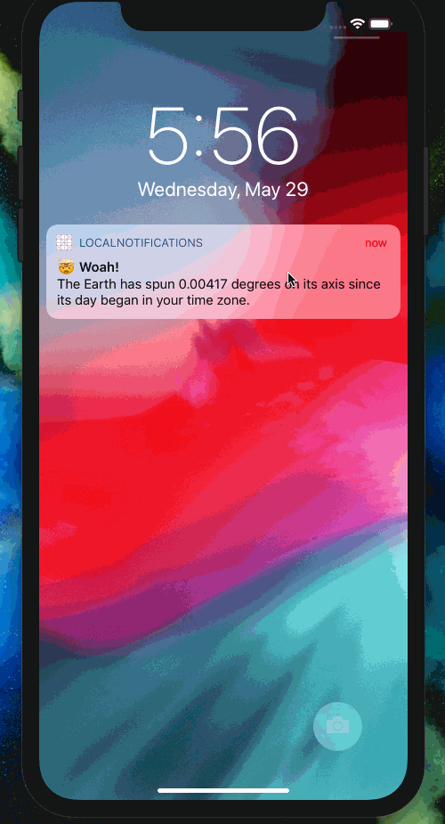

# Day 73: _Project 21: Local Notifications_, Part Two

This day covers the second and final part of `Project 21: Local Notifications` in _[Hacking with Swift](https://www.hackingwithswift.com/read/21)_.
You can follow along directly [here](https://www.hackingwithswift.com/100/73).

## 📒 Field Notes

> I previously created projects alongside _Hacking with Swift_ in a [separate repository](https://github.com/CypherPoet/book--hacking-with-swift). For _100 Days of Swift_, however, I've been extending things further and adding my projects to this repo under each "Part One" folder.
>
> With that in mind, Day 73 focuses on extending the `Local Notifications` project according to a set of challenges.

## 🥅 Challenges

### Challenge 1

> Update the code in `didReceive` so that it shows different instances of `UIAlertController` depending on which action identifier was passed in.

- 🔗 [Commit](https://github.com/CypherPoet/100-days-of-swift/commit/c7bcfb94adaa7bb89ccece353e063d5154ce8785)

### Challenge 2

> For a harder challenge, add a second `UNNotificationAction` to the `alarm` category of project 21. Give it the title “Remind me later”, and schedule it to be shown in 24 hours.

- 🔗 [Commit](https://github.com/CypherPoet/100-days-of-swift/commit/44777bc3c97df2ee2ea66a864ba6acd024e9ff8f)

### Challenge 3

> Update `Project 2: Guess the Flag` so that it reminds players to come back and play every day.

- 🔗 [Commit](https://github.com/CypherPoet/100-days-of-swift/commit/0f63a07afd433522c183c930715fdcc4638ca8ed)

## 📸 Screenshots

  

